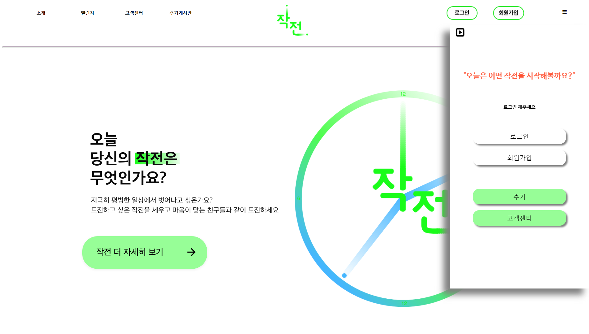

## 코로나 시대를 현명하게 대처하는 "다 함께 챌린지" - 작전명 : 404에러

## 프로젝트 개요
### 프로젝트 팀명 : 작전명 404에러 의미
```
프로젝트명 : 작전
작심(作心)         : 마음을 단단히 먹음
이심전심(以心傳心) : 마음과 뜻이 서로 통함
'작' 심 '전' 심 -> 마음먹은 일을 뜻이 맞는 사람과 함께 한다. 
```

```
팀명 : 404에러
-> 프로젝트를 진행하면서 발생하는 어떠한 장애(에러)도 함께 모여 힘써 이겨내자
```

### 개발 배경 및 작품 소개
남녀노소, 언제 어디서든, 누구든지 함께 환경과 상황에 얽매이지 않고 온라인상에 모여 도전하고 성취하고 결과물을 얻어가는 도전, ‘챌린지’를 다루는 것, 인생의 수많은 부분에 대해 챌린지, 도전을 하고자 하는 이들이 지혜롭게 꿈을 이룰 수 있도록 도와주는 웹사이트를 제작

1) 코로나 시대에 비대면으로도 가능한 '챌린지 모임' 제공
2) 각종 제한 속에서 지혜롭게 일상을 보내는 방안 제시
3) 다양한 참가자들과 열정공유, 의지확립, 코로나 블루 극복
--> 결과적으로, 스스로의 성취감 + 삶의 만족 + 습관개선 이점!

***

### 사용 기술
```
<Development Tool> Eclipse, Spring STS3
<Design> Adobe Illustrator, Adobe XD
<Server> Apache Tomcat 9.0
<Language> JAVA 1.8, JSP, HTML5, CSS3, JavaScript, Mybatis, AJAX, Oracle 11g
<Library> lombok, JQuery, AJAX, Bootstrap, JSTL/EL
<OS> Window10 64Bit
<DBMS> Oracle Sql Developer
<SCM> Github, Sourcetree
<Meeting> Discord, Zoom, Google Meet
```

***
  
### UserPage UI/UX
</img>
***
</img>
***
</img>
***
</img>
***
</img>
***
</img>
***

### Developer

#### 편준장 (총괄팀장) jjp2548@gmail.com
- FrontEnd & BackEnd

#### 이지은 (후기게시판) x931112@naver.com
- FrontEnd & BackEnd

#### 손현종 (계정) hge4587@gmail.com
- FrontEnd & BackEnd

#### 조민형 (챌린지) chominhyeong@gmail.com
- FrontEnd & BackEnd

#### 최혜정 (고객센터) haejung98@naver.com
- FrontEnd & BackEnd

#### 박진영 (메인소개) qw789wlsdud@naver.com
- FrontEnd

***

### Git
MISSION (User page & Manage page)
https://github.com/Pyeon0904/MISSION.git
